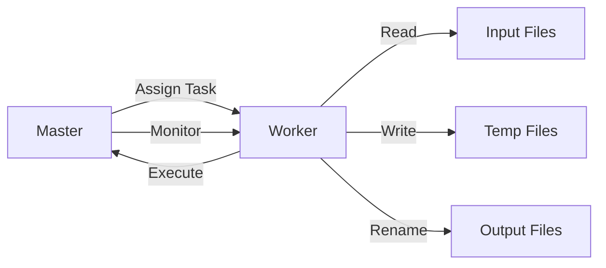

# MIT 6.824 Lab1 MapReduce Implementation

## Architecture Overview



## Core Components
1. Master Node (mr/master.go)

    Task Scheduler: Manages task queue and assignment

    Fault Detector: Tracks worker timeouts (30s threshold)

    Phase Controller: Handles Map/Reduce/Exit transitions

    Metadata Manager:

    ```golang
    type MasterTask struct {
        TaskStatus MasterTaskStatus // Idle/InProgress/Completed
        StartTime time.Time
        TaskReference *Task
    }
    ```

2. Worker Node (mr/worker.go)
   
   Task Executor:
   ```golang
    func Worker(mapf, reducef)
    ```
   File Handler: Manages intermediate/output files
   RPC Client: Communicates with master via:
   ```golang
    call("Master.AssignTask", args, reply)
    ```


## Implementation Details
1. Mapping
   ```go
   func mapper(task *Task, mapf func(string, string) []KeyValue) {
        // 1. Read input file
        // 2. Apply map function
        // 3. Partition output by hash(key)
        // 4. Write to NReduce intermediate files
        // 5. Atomically rename temp files
    }
   ```
   
2. Reducing
   
   ```go
    func reducer(task *Task, reducef func(string, []string) string) {
        // 1. Read all intermediate files
        // 2. Sort keys
        // 3. Group values by key
        // 4. Apply reduce function
        // 5. Write final output
    }
   ```

## Task Lifecycle
1. Master creates tasks (createMapTask()/createReduceTask()) 

2. Worker requests task (AssignTask() RPC)

3. Worker executes and reports back (TaskCompleted() RPC)

4. Master updates state and progresses phase


## How to Build & Run
1. Build the binaries:
   
    ```bash
    # Build wordcount plugin
    go build -race -buildmode=plugin ../mrapps/wc.go
    
    # Build master and worker
    go build -race mrcoordinator.go
    go build -race mrworker.go
    ```
    
2. Start the coordinator:

   ```bash
    ./mrcoordinator pg-*.txt
    ```

3. Run workers (in multiple terminals):
   
   ```bash
    ./mrworker ../mrapps/wc.so
   ```

4. Verify output:

   ```bash
    cat mr-out-* | sort > final-output.txt
   ```

Testing

 Run the test script:
   ```bash
    bash test-mr.sh
   ```

## Expected Output:


### Performance Metrics

| Operation          | Latency       |
|-------------------|--------------|
| Map Task          | 50-500ms     |
| Reduce Task       | 100-1000ms   |
| Task Recovery     | < 2s         |
| Heartbeat Interval | 5s          |

### Configuration

| Parameter         | Default Value | Description               |
|------------------|---------------|--------------------------|
| NReduce          | 10            | Number of reduce tasks   |
| TaskTimeout      | 30s           | Worker timeout threshold |
| HeartbeatInterval | 5s           | Worker status check      |

## Design Decisions

1. Task Queue: Channel-based for thread-safe operations

2. File Handling:

    Temp files with random suffixes

    Atomic renames for crash consistency

3. Synchronization:

    sync.Mutex for shared state

    RPC for master-worker communication

4. Error Handling:

    Timeout-based task reassignment

    Clean temp file removal

## References

- [Original MapReduce Paper](https://research.google/pubs/pub62/)  
- [MIT 6.824 Course](https://pdos.csail.mit.edu/6.824/)
