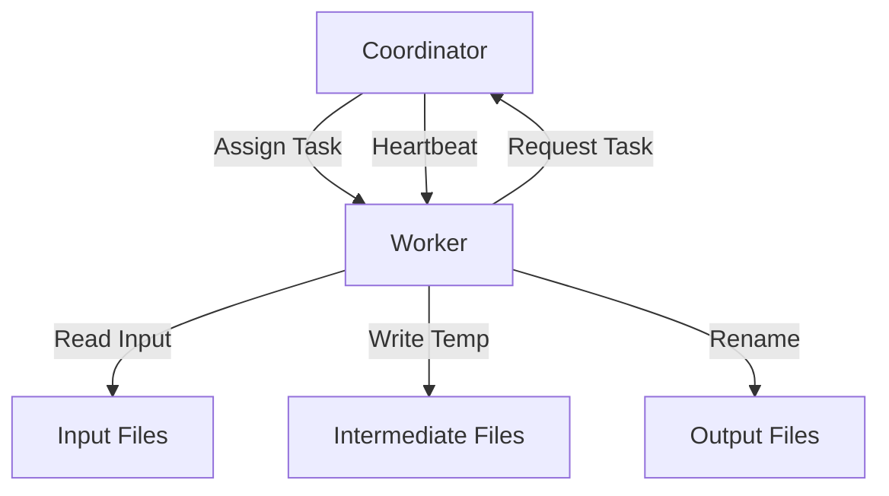

# MIT 6.584 Lab 1: MapReduce Implementation

## Architecture Overview

## Core Components
1. Coordinator (Master)

    Manages entire job lifecycle

    Tracks task states (Idle/In-Progress/Completed)

    Handles worker failures via timeout

    Maintains intermediate file locations

    Implements task scheduling logic

2. Worker Processes

    Request tasks from Coordinator via RPC

    Execute either Map or Reduce functions

    Store intermediate output in temporary files

    Atomically rename files upon completion

    Report results back to Coordinator

